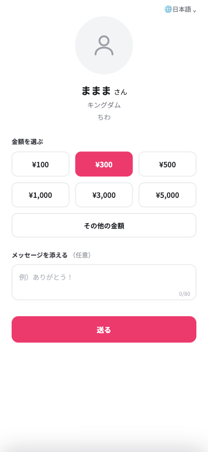
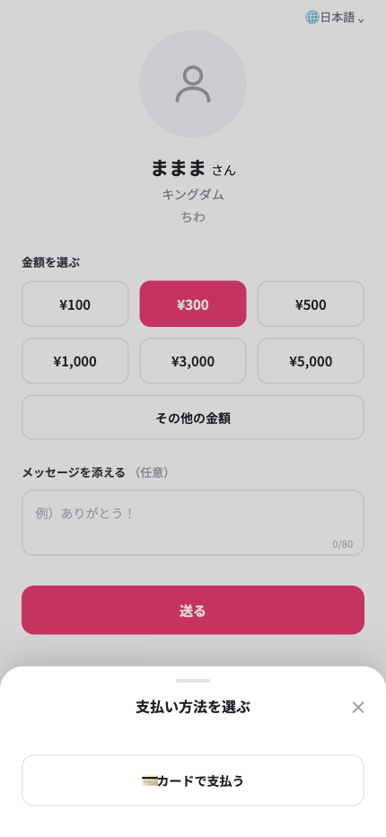
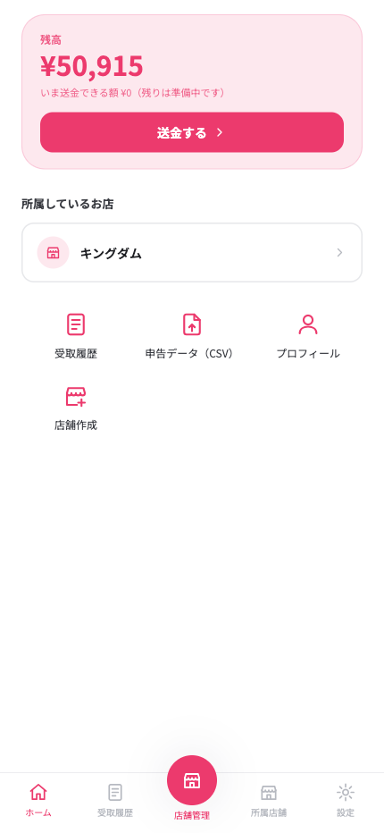
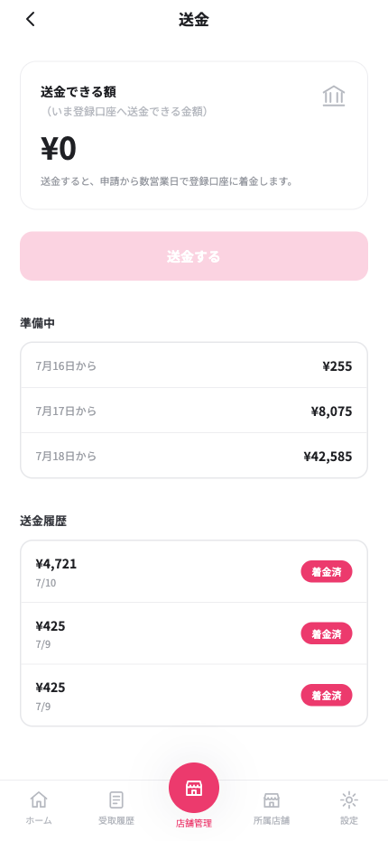
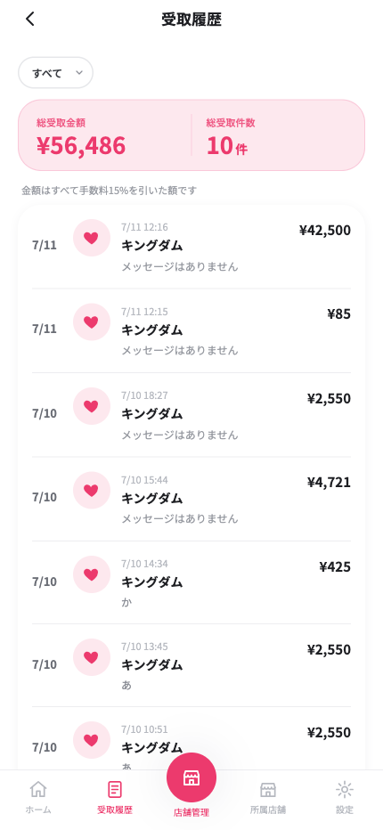
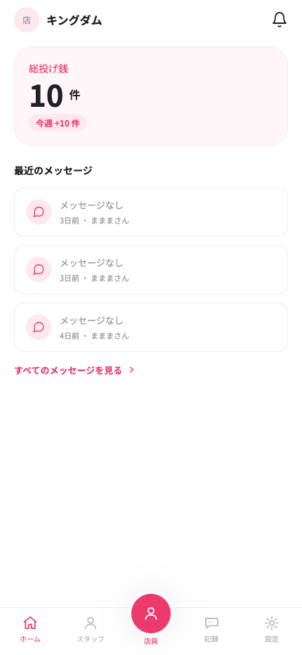
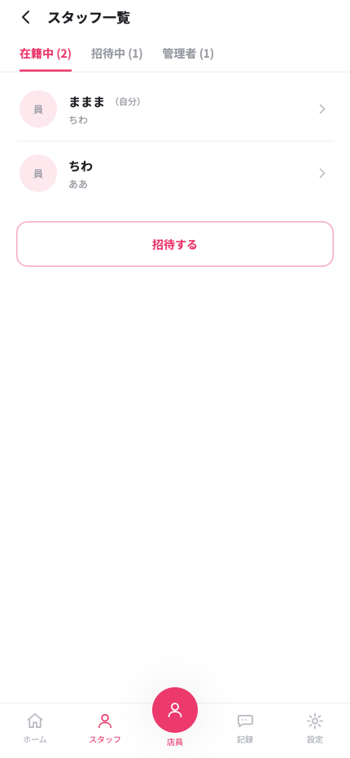

# Arigato

**ありがとうを、その場で。** — 飲食店などの店員さんに、お客さまがQRコードから直接チップ（投げ銭）を送れるWebアプリです。

お客さまはアプリのインストールもログインも不要。店員さんのQRを読み取り、金額を選んで **Apple Pay / Google Pay / カード** でその場で送れます。受け取ったチップは店員さん個人のものになり、本人確認を済ませれば自分の銀行口座へ送金できます。

## スクリーンショット

### お客さま（ログイン不要）

| 投げ銭画面 | 支払いシート |
|:---:|:---:|
|  |  |
| QRから開き、金額とメッセージを選ぶ | アプリ内で決済が完結（実機では Apple Pay / Google Pay ボタンも同時表示） |

### 店員さん

| ホーム | 送金 | 受取履歴 | 専用QR |
|:---:|:---:|:---:|:---:|
|  |  |  |  |
| 残高と送金できる額 | 準備中の内訳（日付別）と送金履歴 | 受け取ったチップとメッセージ | 印刷・画像保存できる自分専用QR |

### 店舗管理者

| 店舗ホーム | スタッフ管理 |
|:---:|:---:|
|  |  |
| お店への投げ銭件数と最近のメッセージ | スタッフ・管理者の招待と在籍管理 |

## 特徴

- **お客さまはログイン不要** — QRを読んで金額を選ぶだけ。Apple Pay / Google Pay / カードでアプリ内決済（リダイレクトなし）
- **お金は店員さん個人に直接入る** — Stripe Connect の Direct charge を採用。決済の瞬間から資金は店員さん個人のStripe口座にあり、プラットフォームはお金を預からない（投げ銭サービスとして法的に最も筋の良い構成）
- **手数料は 15%** — 店員さんの手取りは85%。手数料の内訳は決済時にお客さま向けに明示
- **本人確認（KYC）も送金もアプリ内で完結** — Stripe の埋め込みコンポーネントでオンボーディングし、審査状態（申請中 / 要対応 / 承認済み）をホームに表示
- **店員と店舗管理の統合アカウント** — 1つのアカウントで「店員」と「店舗管理」をボトムナビ中央からモード切替。店舗にはスタッフ・共同管理者を招待できる
- **整合性への強いこだわり** — 残高の真実の源泉はStripe（DBは鏡）、Webhook＋自己修復（self-heal）＋日次照合の多層防御、二重送金・二重課金の構造的防止

## お金の流れ

```
お客さま ── Apple Pay / カード ──▶ 店員さんの Stripe 連結口座（Direct charge）
                                      │  チップ額の 85%（15% はプラットフォーム手数料）
                                      │  数日の確定期間（準備中）を経て送金可能に
                                      ▼
                              店員さんの銀行口座（本人がアプリから送金）
```

- 決済確定は Stripe Webhook を正とし、取りこぼしは自己修復・照合ジョブで回収
- 送金可能額は送金直前に Stripe の実残高（available）で再判定（残高不足を構造的に回避）
- 返金・チャージバックはWebhookで検知し、残高・履歴・送金候補へ自動反映

## 技術スタック

| 領域 | 技術 |
|---|---|
| モノレポ | pnpm workspaces + Turborepo |
| フロントエンド | Vite + React + TypeScript / TanStack Router・Query / Zustand / Tailwind CSS / react-i18next |
| バックエンド | Hono（Node.js）+ Hono RPC（型安全なAPIクライアント共有） |
| DB / 認証 / ストレージ | Supabase（PostgreSQL / Auth / Storage）+ Drizzle ORM（生SQL） |
| 決済 | Stripe Connect（Direct charge・Embedded onboarding・Payment Element / Express Checkout Element） |
| バリデーション | Zod（`packages/shared` でフロント・バック共有） |
| テスト | Vitest（API 300件超・Web）+ Playwright（E2E） |
| ホスティング | フロント: Cloudflare Workers / API: Render / DB: Supabase |

詳細な選定理由は [docs/tech-stack.md](docs/tech-stack.md) を参照。

## アーキテクチャ

Feature-based 構成 + バックエンドは4層分離。詳細は [docs/architecture.md](docs/architecture.md)。

```
Route（HTTP・認証・Zod検証）
  └─ Service（ユースケース・業務ルール）
       └─ Model（純粋なドメインロジック・単体テストの主対象）
       └─ Repository（生SQL。DBに触るのはここだけ）
外部API（Stripe / Supabase）→ infrastructure に隔離し、コンポジションルート（app.ts）で注入
```

主な原則:

- feature 同士は直接 import しない（依存はコンポジションルートで配線）
- Zod スキーマは `packages/shared` で共有し、フロント・バックで二重定義しない
- 残高・決済の真実の源泉は Stripe。自前DBは「鏡」を持ち、Webhookと照合で同期する

### ディレクトリ構成

```
├── apps/
│   ├── web/          # フロントエンド（Vite + React SPA）
│   │   └── src/features/{tip, staff, store, auth}/
│   └── api/          # バックエンド（Hono API）
│       └── src/
│           ├── features/{tip, staff, store, webhook}/   # Route→Service→Model→Repository
│           ├── infrastructure/{stripe, supabase}/       # 外部API隔離
│           └── jobs/                                    # 照合バッチ（reconcile）
├── packages/
│   ├── shared/       # Zodスキーマ・型（フロント・バック共有）
│   └── db/           # Drizzleスキーマ・マイグレーション
└── docs/             # 仕様・設計・運用ドキュメント
```

## デプロイ

テスト公開（ステージング）の構成・手順・本番ローンチ時のチェックリストは [docs/deploy.md](docs/deploy.md) にまとめています。

```
ブラウザ ──▶ Cloudflare Workers（静的SPA） ──▶ Render（Hono API） ──▶ Supabase
                                                   ▲
                                                   └── Stripe Webhook
```

## ドキュメント

| ドキュメント | 内容 |
|---|---|
| [docs/spec.md](docs/spec.md) | 製品仕様書 |
| [docs/architecture.md](docs/architecture.md) | アーキテクチャルール |
| [docs/tech-stack.md](docs/tech-stack.md) | 技術スタックと選定理由 |
| [docs/design-tokens.md](docs/design-tokens.md) | デザイントークン（色・角丸・フォント） |
| [docs/deploy.md](docs/deploy.md) | デプロイ手順・本番ローンチチェックリスト |
| [docs/payment-bugs.md](docs/payment-bugs.md) | 決済まわりで踏んだバグと対策の記録 |
| [docs/analysis/](docs/analysis/) | 調査レポート（PayPay対応の実現可能性など） |

## 決済手段の対応状況

| 決済手段 | 状態 |
|---|---|
| クレジットカード / デビットカード | ✅ 対応 |
| Apple Pay / Google Pay | ✅ 対応（決済手段ドメインの登録が必要。[docs/deploy.md](docs/deploy.md) 参照） |
| PayPay | ⏳ 未対応（Stripe Connect の PayPay 対応GAを待って実装予定。経緯は [docs/analysis/2026-07-10-paypay-marketplace-psp.md](docs/analysis/2026-07-10-paypay-marketplace-psp.md)） |

## ライセンス

**All rights reserved.**

本リポジトリのコード・ドキュメント・アイデアの複製・転用・再配布を禁止します。
